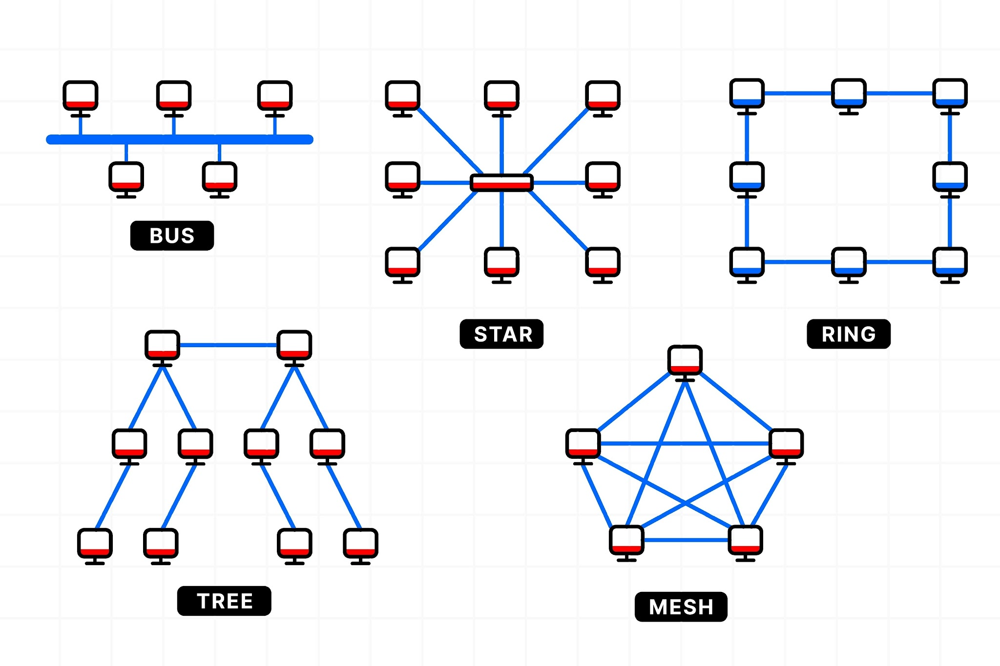

## 네트워크
### 1. 네트워크란?
**여러 장치가 서로 연결되어 정보를 주고받을 수 있는 통신망**을 네트워크라고 합니다.

사람들이 네트워킹하고 정보를 주고받는 것처럼, 컴퓨터도 네트워크를 이루며 장치들끼리 정보를 주고받습니다.

___

### 2. 네트워크의 분류
네트워크는 크기에 따라 **LAN, MAN, WAN** 3개로 분류할 수 있습니다.
각각은 Local Area Network, Metropolitan Area Network, Wide Area Network를 의미합니다.

|     | 규모                   | 예시                |
|:---:|:----------------------|:-------------------|
| LAN | Local, 건물 규모        | 학교, 사무실, 개인 공간 |
| MAN | Metropolitan, 도시 규모 | 서울시               |
| WAN | Wide, 세계 규모         | 한국                |

WAN으로 갈수록 규모가 커지므로, 더 혼잡하고 전송 속도가 느린 네트워크라고 볼 수 있습니다.

___

### 3. 네트워크의 성능
네트워크를 성능을 알아볼 수 있는 지표는 두가지가 있습니다.
(1) **처리량**: 성공적으로 전달된 데이터의 양
(2) **지연 시간**: 요청이 처리되는 시간
처리량은 높을 수록, 지연 시간은 낮을 수록 좋은 네트워크일 것입니다.

처리량은 트래픽, 대역폭, 네트워크 중간에 발생하는 에러, 장치의 하드웨어 스펙에 영향을 받습니다.
지연 시간은 연결선의 유선/무선 여부, 패킷의 크기, 라우터의 패킷 처리 시간에 영향을 받습니다.

> **트래픽** 흐르는 데이터의 양
> **대역폭**(bandwidth) 데이터가 최대 얼마까지 흐를 수 있는가
> **패킷** 전송되는 데이터
> **라우터** 패킷이 최적의 경로를 찾아 전달되도록 하는 장치

___

### 4. 네트워크 토폴로지
네트워크 토폴로지란 **네트워크에 연결된 컴퓨터와 케이블 등의 구성 요소(노드, 링크)들이 배치된 방식**을 의미합니다.
버스 토폴로지, 스타 토폴로지, 링 토폴로지, 트리 토폴로지, 메시 토폴로지가 있습니다.

네트워크 토폴로지를 학습하면, 병목 현상을 찾고 올바르게 해결할 수 있습니다.
대역폭을 크게 설정했음에도 성능이 개선되지 않을 때, 사용자는 네트워크 토폴로지가 어떻게 되어 있는지 확인하고, 회선을 추가해서 병목 현상을 해결할 수 있습니다.

> **병목(bottleneck) 현상**
>
> 병목 현상은 병의 크기에 비해 병의 목이 훨씬 작기 때문에 물이 천천히 쏟아지는 것처럼 네트워크에서 **어떤 구성 요소로 인해 지연이 발생하는 것**입니다.
> 병목 현상의 주된 원인으로는 네트워크 대역폭, 네트워크 토폴로지, 서버 CPU/메모리 사용량, 비효율적인 네트워크 구성이 있습니다.
> 

___

### 5. 네트워크 성능 분석 명령어
- ping
    - ICMP 프로토콜을 통해 **네트워크 상태를 확인하고 싶은 노드에 패킷을 전송**하는 명령어
    - **네트워크 연결 상태와 응답 속도**를 확인할 때 사용
    `ping www.google.com`

- netstat
    - 현재 네트워크 연결 상태, 포트 사용 현황, 라우팅 테이블 등을 보여주는 명령어
    - 로컬 컴퓨터가 **어떤 서버와 어떤 포트를 통해 통신 중인지 분석**할 때 사용
    `netstat`

- nslookup
    - **도메인 이름과 IP 주소 간의 매핑**을 조회
    `nslookup` → `google.com`

- traceroute
    - Windows에서는 `tracert`사용
    - **패킷이 목적지까지 도달하는 경로**를 확인
    - **어느 구간에서 느려지는지** 확인 가능
    `traceroute www.google.com`

> 라우팅 테이블이란 목적지 정보들과 그 목적지로 가기 위한 방법이 들어있는 리스트입니다

___

### 6. 네트워크 프로토콜 표준화
네트워크 프로토콜이란 다른 장치들끼리 데이터를 주고받기 위해 **약속된 인터페이스**입니다.
이는 개인이 아닌 IEEE 또는 IETF라는 표준화 단체가 정하는 것입니다.
다들 한번쯤 들어봤을 HTTP도 웹 서비스를 기반으로 데이터를 주고 받을 수 있도록 하는 프로토콜입니다.

___

### 7. TCP/IP 4계층 모델

프로토콜의 네트워킹 범위에 따라 인터넷 통신의 기본 구조를 네 개의 추상화 계층으로 구성한 네트워크 모델입니다.
네트워크 액세스 계층, 인터넷 계층, 전송 계층, 응용 계층 4가지 계층이 존재합니다.

#### (1) 응용 계층 (L5, L6, L7)
사용자나 응용 프로그램이 네트워크를 사용할 수 있게 하는 계층입니다.
- 네트워크 기기
    - L7 스위치 (aka. Application 로드밸런서): IP, 포트, URL, HTTP 헤더, 쿠키 등을 기반으로 트래픽을 분산
- 주요 프로토콜
    - HTTP(S): 웹 통신
    - FTP: 파일 전송
    - SMTP: 이메일
    - DNS: 도메인 → IP 변환

> **로드 밸런서의 특징**
> 로드 밸런서들은 모두 정상적인 서버인지 여부를 판단하는 요청을 반복적으로 보내는 '헬스 체크'를 함
> 서버 이중화를 통해 하나의 서버가 종료되도 안정적으로 운영 가능

#### (2) 전송 계층 (L4)
송신자와 수신자를 연결하는 통신 서비스를 제공하는 계층입니다.
- 네트워크 기기
    - L4 스위치 (aka. Network 로드밸런서): IP와 포트를 기반으로 트래픽을 분산
- 주요 프로토콜
    - TCP (Transmission Control Protocol)
    - UDP (User Datagram Protocol)

    | TCP | UDP |
    |:---:|:---:|
    |가상회선 패킷 교환 방식|데이터그램 패킷 교환 방식|
    |||
    |패킷 순서 보장|패킷 순서 랜덤|
    |연결 지향|비연결형|
    |3-way handshake로 신뢰성 높음|신뢰성 낮음 → 스트리밍에 주로 사용|
    |속도 느림|속도 빠름|

    > 중요한 서류나 물건을 보낼 때, 수신인에게 정확하게 전달하기 위해서 "등기 우편"을 사용하죠.
    > TCP는 등기 우편, UDP는 엽서처럼 생각할 수 있습니다!
    
    > 3-way handshake는 통신 양쪽이 실제로 살아 있는지, 데이터 송수신이 가능한 상태인지 확실히 확인하는 **연결의 유효성 보장**에 중요한 역할을 합니다
    >
    > 
    > (1) SYN : 클라이언트에서 연결 요청
    > (2) SYN_ACK : 서버에서 요청을 수락
    > (3) ACK : 수락 확인 → 연결 완료!

#### (3) 인터넷 계층 (L3)
데이터 패킷을 지정된 목적지(IP 주소)까지 전달, 즉 라우팅 기능을 하는 계층입니다.
- 네트워크 기기
    - 라우터: 최적 경로 결정 및 패킷 전달
        - L3 스위치: 라우팅 테이블, IP 패킷, IP 주소를 참조하여 하드웨어 기반 라우팅을 하는 라우터
- 주요 프로토콜
    - IP (IPv4/IPv6): 데이터 패킷의 주소 지정 및 라우팅 담당
    - ARP (주소 변환): IP 주소를 MAC 주소로 변환해주는 프로토콜 (↔ RARP: MAC을 IP로)
    - ICMP: IP 통신 과정에서 발생하는 오류를 알리거나, 네트워크 상태 및 진단을 지원 (`ping` 명령어에서 사용)

    > IPv4: 32비트를 8비트 단위로 점을 찍어 표기 (123.45.67.89)
    > IPv6: 64비트를 16비트 단위로 점을 찍어 표기 (2001:db8::ff00:42:8329)
    > +) IP 주소는 인터넷에서 사용하는 네트워크 주소이기 떄문에 이를 통해 동 또는 구까지 위치 추적이 가능합니다.

#### (4) 네트워크 액세스 계층 (L1, L2)
LAN 케이블이나 무선(Wi-Fi)을 통해 데이터, 신호가 전송되는 물리적 단계의 계층입니다.
- L2 네트워크 기기
    - L2 스위치: MAC 주소 테이블, 이더넷 프레임, MAC 주소를 참조하여 패킷 전송
    - 브리지: 두 개의 LAN을 상호 접속할 수 있도록 하는 통신망 연결 장치
    
- L1 네트워크 기기
    - NIC (Network Interface Card): 컴퓨터를 네트워크에 연결해주는 하드웨어 장치. 각 NIC에는 고유한 MAC 주소가 있음
    - 리피터: 약해진 신호 정도를 증폭해서 전송 거리를 늘려주는 장치
    - AP (Access Point): 무선 장치가 유선 네트워크에 접속할 수 있도록 중간에서 연결해주는 장치
- 주요 프로토콜
    - IEEE 802.3 (Ethernet): 유선 LAN → 전이중화 통신
    - IEEE 802.11 (Wi-Fi): 무선 LAN → 반이중화 통신

    > 전이중화 통신은 송신로와 수신로가 나뉘어져 있어 동시에 데이터를 주고 받을 수 있지만, 반이중화 통신은 송수신로가 같아서 한번에 한 방향만 통신할 수 있습니다.
    >
    > 
    > 

___

### 8. 계층 간 데이터 송수신 과정
사용자가 웹 브라우저로 https://example.com 접속할 때,
1. 응용 계층: 브라우저가 HTTP 요청 메시지를 생성
2. 전송 계층: TCP가 요청을 세그먼트로 쪼개고, 포트 번호로 구분
3. 인터넷 계층: IP가 목적지 주소를 붙이고 라우팅 경로 결정
4. 네트워크 접근 계층: 이더넷을 통해 전기 신호(또는 무선 신호)로 전송

___

### 9. PDU (protocol data unit)
네트워크의 어떠한 계층에서 계층으로 데이터가 전달될 때 한 덩어리의 단위
헤더(제어 관련 정보)와 페이로드(데이터)로 구성

1. 응용 계층: 메시지
2. 전송 계층: 세그먼트(TCP), 데이터그램(UDP)
3. 인터넷 계층: 패킷
4. 링크 계층: 프레임(L2 데이터 링크 계층), 비트(L1 물리계층)

___

### 10. 홉바이홉(hop) 통신
IP 주소를 통해 통신할 때는 TCP 연결처럼 출발지와 목적지가 직접 연결된 것이 아니라, 여러 중간 노드를 통하고 통해서 전달됩니다. 이 과정을 홉바이홉이라고 합니다.

택배가 서울 물류센터 → 대전 허브 → 대구 허브 → 부산 물류센터를 거쳐 고객으로 전달되는 것처럼 서브네트워크 안에 있는 라우터의 라우팅 테이블 IP를 기반으로 패킷을 전달하고 전달하는 것을 의미합니다.

___

### 11. 게이트웨이 (Gateway)
**서로 다른 통신망, 프로토콜을 사용하는 네트워크 간의 통신을 가능하게 하는 관문 역할을 하는 컴퓨터 또는 소프트웨어**입니다.

___

### 12. DHCP (Dynamic Host Configuration Protocol)
네트워크에 새로 접속한 장치(PC, 스마트폰 등)에 자동으로 IP 주소, 서브넷 마스크, 게이트웨이, DNS 서버 등의 네트워크 설정 정보를 할당해주는 프로토콜. **네트워크의 자동 IP 배포 시스템**입니다.

___

### 13. NAT (Network Address Translation)
내부 네트워크의 **사설 IP 주소**(private IP)를 외부 네트워크(인터넷)의 **공인 IP 주소**(public IP)로 변환해주는 기술입니다.
NAT를 가능하게 하는 소프트웨어는 ICS, RRAS, Netfilter 등이 있습니다.

> 전 세계에서 쓸 수 있는 IPv4 주소는 약 43억 개 한정이라서 부족합니다.
> 하지만 가정이나 회사에는 수십, 수백 대의 기기가 인터넷에 접속해야 합니다.
> 그래서 NAT를 이용해 하나의 공인 IP로 여러 사설 IP 장치가 인터넷을 공유하게 됩니다.

> 실제로 집에서 공유기가 하고 있는 핵심 기능이 NAT(사설 ip → 공인 ip) + DHCP(자동 ip 배포)입니다.

NAT를 이용하면 내부 네트워크에서 사용하는 IP 주소와 외부에 드러나는 IP 주소를 다르게 유지할 수 있어서 보안이 가능해진다는 장점이 있습니다. 하지만, 여러 명이 동시에 인터넷을 접속하게 되므로 접속 수에 따라 느려질 수도 있다는 단점이 있습니다.

___

### 14. HTTP
#### (1) HTTP/1.0
- 파일을 가져올 떄마다 TCP 연결(3-way handshake)
    → RTT 증가

> **RTT** 패킷이 목적지에 도달하고 나서 다시 출발지로 돌아오기까지 걸리는, 왕복 시간

- RTT 증가를 해결하기 위한 방법
    - 이미지 스플리팅: 많은 이미지를 다운로드 받으면 과부하가 걸리기 때문에, 많은 이미지가 합쳐진 하나의 이미지를 다운로드받고 `background-image`의 `position`을 이용하여 이미지를 표기
    - 코드 압축: 개행 문자, 빈칸 등을 없애서 코드 크기를 최소화
    - 이미지 Base64 인코딩: 이미지 파일을 64진법으로 이루어진 문자열로 인코딩
        - +) 서버와 연결을 열고 이미지에 대한 요청을 할 필요가 없음
        - -) 크기가 37% 정도 커짐

> **인코딩** 표준화, 보안, 처리 속도 향상, 자원 공간 절약 등을 위해 데이터를 다른 형식으로 변환하는 것

#### (2) HTTP/1.1
- 한번 TCP 초기화를 한 이후에 `keep-alive`라는 옵션으로 여러 개의 파일을 송수신
    → +) TCP 3-way handshake가 발생하면 그다음부터 발생하지 않음
    → -) 문서 안에 다수의 리소스를 처리하려면 대기 시간이 너무 길어짐
    → -) 헤더의 많은 메타데이터들이 압축되지 않아 무거웠음

> **HOL Blocking**(Head Of Line Blocking) 같은 큐에 있는 패킷이 첫번째 패킷에 의해 지연되는 성능 저하 현상
    
#### (3) HTTP/2
- 멀티 플렉싱: 여러 개의 병렬적인 스트림을 사용하여 쪼개진 데이터를 송수신 → HOL Blocking 문제 해결
    
    > **스트림** 시간이 지남에 따라 사용할 수 있게 되는 일련의 데이터 요소를 가리키는 데이터 흐름
- 헤더 압축
    - 허프만 압축 알고리즘: 적게 나온 문자는 큰 비트 수로, 많이 나온 문자는 작은 비트 수를 사용하여 데이터를 표현
- 서버 푸시: 클라이언트의 요청 없이 서버가 바로 리소스를 푸시
    

#### (4) HTTPS
애플리케이션 계층과 전송 계층 사이에 신뢰 계층인 SSL/TLS 계층을 넣은 HTTP 요청

**SSL/TLS** 전송 계층에서 보안을 제공하는 프로토콜, 제3자가 사용자 정보를 가로재치(인터셉터) 못하게 함

**보안 세션**
보안이 시작되고 끝나는 동안에 유지되는 세션. SSL/TLS는 핸드셰이크를 통해 보안 세션을 생성합니다.
> **세션** 운영체제가 사용자로부터 자신의 자산 이용을 허락하는 기간

클라이언트는 처음 연결할 때 "어떤 프로토콜·암호화·해싱 알고리즘으로 통신할지"를 사이퍼 슈트라는 규약을 서버에 보내 합의한 후 그 규약에 따라 서버에서 클라이언트로 인증서를 보내는 인증 메커니즘이 시작되고 이후 해싱 알고리즘 등으로 암호화된 데이터의 송수신이 시작됩니다.

**인증 매커니즘**
CA(Certificate Authorities)에서 발급한 인증서(서비스 정보, 서버의 공개키, 지문 - 공개키를 해시한 값, CA의 디지털 서명)를 기반으로 서버가 신뢰할 수 있는 서버임을 보장합니다.

> **개인키** 개인이 소유하고 있는 키이자 반드시 본인만이 소유해야 함 (=비밀키)
> **공개키** 공개되어 있는 키

**암호화 알고리즘**
키 교환 암호화 알고리즘으로는 대수곡선 기반의 ECDHE 또는 DHE를 사용
둘다 디피-헬만 방식을 근간으로 만들어짐

> **디피-헬만 키 교환 암호화 알고리즘**
`y = g^2 % p`
→ g, x, p를 안다면 y를 구하기 쉽지만, g, y p만 안다면 x를 구하기는 어려움을 이용한 방식입니다.

**해싱 알고리즘**
데이터를 추정하기 힘든 더 작고, 섞여 있는 조각으로 만드는 알고리즘입니다.
ex) SHA-256 알고리즘 - 해시 함수의 결괏값이 256비트인 알고리즘. 블록체인 시스템에서도 사용
(한별 → `c53b7d3bab483fbc16ea737477d4a25dff12924847077b50f6a75f96f6b37f8e`)

**SEO에도 도움이 되는 HTTPS**
구글은 SSL 인증서를 강조하며 HTTPS 서비스를 하는 사이트가 SEO 순위가 더 높을 것이라고 밝혔습니다.

> SEO란 검색엔진 최적화를 의미하며, SEO를 관리하는 방법으로는 캐노니컬 설정, 메타 설정, 페이지 속도 개선, 사이트맵 관리 등이 있습니다.

**HTTPS 구축 방법**
(1) 직접 CA에서 구매한 인증키를 기반으로 HTTPS 서비스 구축하기
(2) 서버 앞단의 HTTPS를 제공하는 로드밸런서 두기
(3) 서버 앞단에 HTTPS를 제공하는 CDN을 두기

#### (5) HTTP/3
TCP에서 돌아가는 HTTP/2와 달리 QUIC라는 계층 위에서 돌아가며, UDP 기반으로 돌아갑니다.

**초기 연결 설정 시 지연 시간 감소**
QUIC는 TCP를 사용하지 않기 때문에
- 번거러운 3-way handshake를 사용하지 않아도 됨
- 첫 연결 설정에 1-RTT만 소요
- 순방향 오류 수정 메커니즘이 적용되어있어 전송한 패킷이 손실되었다면 수신 측에서 에러를 검출하고 수정함
→ 열악한 네트워크 환경에서도 패킷 손실률이 낮음

